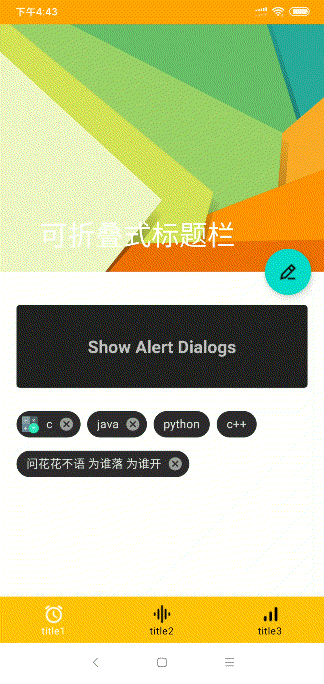
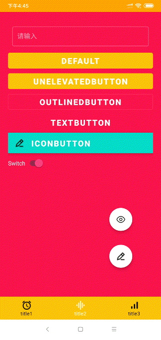
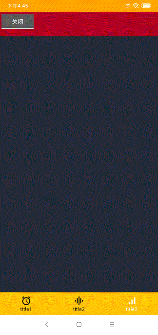
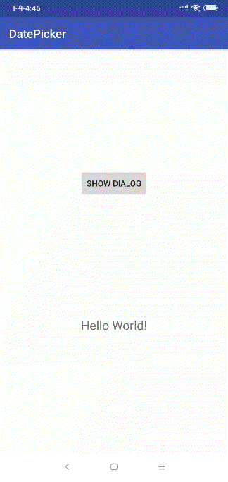

# Material Design
介绍：[官网链接](https://material.io/)

简单来说就一种让我很喜欢的设计风格😂

# 常用组件展示（个人向）

<div style="width:100%;height:500;"class="justified-gallery">









</div>
<!--more-->

# 下面一个个介绍简单用法

> 👉说明：我用的android studio版本为`3.5.3`,gradle版本为`5.4.1`,然后compileSdkVersion 是`28`<br>以下展示的是一些初级用法，
<br>更高级的请参考官网~

> 先前要引入依赖`implementation 'com.google.android.material:material:1.2.0-alpha04'`<br>然后把`style.xml`里改为`Theme.MaterialComponents.NoActionBar`才可以进行以下操作
## Bottom Navigation and Badge


这张gif展示着两组件。一个是`Bottom Navigation`一个是 `Badge`

### Bottom Navigation

就是一个导航栏嘛
#### 使用步骤
1. 创建menu文件，和selector文件
> menu文件用于存放图标文字还有id(设置点击事件时用)<br>
selector文件主要是设置点击时切换的颜色 具体请往下看
在`menu`文件夹中
```xml
<?xml version="1.0" encoding="utf-8"?>
<menu xmlns:android="http://schemas.android.com/apk/res/android">
    <item
        android:id="@+id/tab_one"
        android:icon="@drawable/round_access_alarm_black_36dp"
        android:title="@string/tab_one_titile"
        />
    <item
        android:id="@+id/tab_two"
        android:icon="@drawable/round_graphic_eq_black_36dp"
        android:title="@string/tab_two_titile"
        />
    <item
        android:id="@+id/tab_three"
        android:icon="@drawable/round_signal_cellular_alt_black_36dp"
        android:title="@string/tab_three_titile"
        />
</menu>

```
在`drawable`文件夹中
```xml
<?xml version="1.0" encoding="utf-8"?>
<selector xmlns:android="http://schemas.android.com/apk/res/android">
   <!--    选中时-->
   <item
    android:state_selected="true"
    android:color="@android:color/background_light"/>
    <!--    未选中时-->
    <item
        android:state_selected="false"
        android:color="@android:color/background_dark"/>

</selector>
```

2. 在布局中添加
```xml
<com.google.android.material.bottomnavigation.BottomNavigationView
        app:itemIconTint="@drawable/selector"
        app:itemTextColor="@drawable/selector"
        app:menu="@menu/bottomnavigationmenu"
        android:id="@+id/bottom_navigation"
        android:layout_alignParentBottom="true"
        android:layout_width="match_parent"
        android:layout_height="wrap_content">
    </com.google.android.material.bottomnavigation.BottomNavigationView>
```
```xml
app:itemIconTint="@drawable/selector"
app:itemTextColor="@drawable/selector"
app:menu="@menu/bottomnavigationmenu"
```
主要是上面这三行，意思也很明显，只要指定menu文件 然后就会自动帮你布局下来了

3. 设置点击事件
也很简单
```java
bottomNavigationView.setOnNavigationItemSelectedListener(new BottomNavigationView.OnNavigationItemSelectedListener() {
            @Override
            public boolean onNavigationItemSelected(@NonNull MenuItem item) {
                   switch (item.getItemId()){
                        case R.id.tab_one://在menu中item的id
                        {
                            //点击后的操作。。。
                            break;
                        }
                        case R.id.tab_two:
                        {
                            break;
                        }
                        case R.id.tab_three:
                        {
                            break;
                        }

                    }
                
                return true;//官网解释是：true to display the item as the selected item
            }
        });
```
### Badge
这是显示在图标右上角的一个小数字，用法也很简单
```java
BadgeDrawable badgeDrawable1;
badgeDrawable1=bottomNavigationView.getOrCreateBadge(R.id.tab_one);//获取id
badgeDrawable1.setBackgroundColor(Color.rgb(233,30,99));//设置背景的颜色
badgeDrawable1.setBadgeTextColor(Color.WHITE);//设置数字的颜色
badgeDrawable1.setVisible(true);//设置可见
badgeDrawable1.setNumber(20);//设置数字
```
## Collapsing Toolbars


> 暂时不太理解，待补充

## Alert Dialogs


这个蛮简单的，只需要在设置点击事件时加上如下代码
```java
new MaterialAlertDialogBuilder(getContext())
        .setTitle("Title")
        .setMessage("Message")
        .setPositiveButton("ok",null)
        .show();
```
## Chips


在布局文件中：
```xml
  <com.google.android.material.chip.Chip
        android:text="c"
        app:chipIcon="@drawable/calculator"
        style="@style/Widget.MaterialComponents.Chip.Entry"
        android:layout_width="wrap_content"
        android:layout_height="wrap_content"/>
```
## Material Text View


在布局文件中：
```xml
<com.google.android.material.textfield.TextInputLayout
        style="@style/Widget.MaterialComponents.TextInputLayout.OutlinedBox.Dense"
        android:layout_width="match_parent"
        android:layout_height="wrap_content"
        android:hint="请输入"
        android:padding="10dp">

        <com.google.android.material.textfield.TextInputEditText
            android:layout_width="match_parent"
            android:layout_height="wrap_content" />
    </com.google.android.material.textfield.TextInputLayout>
```
## Snackbars


也蛮简单，在java中如此：
```java
//第一种，无点击事件
 Snackbar.make(coor,"这个是第一个Snackbars",Snackbar.LENGTH_LONG)
         .show();
//第二种，有点击事件
 Snackbar.make(coor,"这个是第二个Snackbars",Snackbar.LENGTH_LONG)
         .setAction("点我试试", new View.OnClickListener() {
              @Override
               public void onClick(View v) {
                Toast.makeText(getActivity(),"你点我干嘛鸭",Toast.LENGTH_SHORT).show();
                }
            })
            .show();
```
## Navigation Views

drawablelayout的更新版本
首先也是要创建menu文件，请参照Bottom Navigation中menu的创建
然后就是创建headerlayout.xml
然后直接引入就可以啦,记住要在`DrawerLayout`里面
```xml
    <androidx.drawerlayout.widget.DrawerLayout
        android:layout_width="match_parent"
        android:layout_height="match_parent">
        <com.google.android.material.navigation.NavigationView
            app:headerLayout="@layout/navigationheader"
            android:layout_width="300dp"
            android:layout_gravity="start|left"
            app:itemTextColor="@color/pink"
            app:menu="@menu/navigationmenu"
            app:itemIconTint="@color/pink"
            android:background="@color/colorPrimary"
            android:layout_height="match_parent">
            
        </com.google.android.material.navigation.NavigationView>
    </androidx.drawerlayout.widget.DrawerLayout>
```
## Date Pickers

## BottomSheet


# 参考资料
