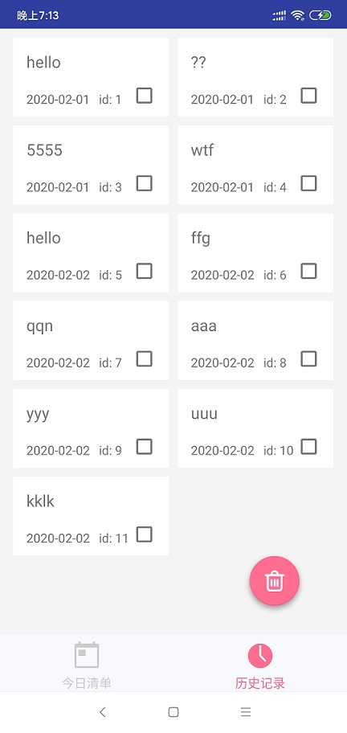

# 开发日志
## 2020年2月1日凌晨
今天就只想把服务端部署到云服务器上

参考教程：
- [搭建云服务器——从零开始搭建可运行JavaWeb项目的云服务器（ps：特别推荐🎉）](https://www.cnblogs.com/occlive/p/ByZero.html)
- [使用navicat连接阿里云服务器](https://blog.csdn.net/sigmeta/article/details/79850694)

刚那一会连接成功是成功了，但是又出现了编码方式问题T.T
<!--more-->
试着改了一下还是不行，心累

## 2020年2月2日

这次实现了一个长按item后出现复选框，然后可以选择删除（待实现）的效果，如下

### 实现方法
其实也蛮简单，就是在item中先添加一个checkbox控件，然后隐藏起来，长按item后显示checkbox，然后也显示删除的悬浮按钮，就这么简单，奈何我实现了半天，还是太菜啊😥

# 📌暂时不做了
## 2020年2月12日凌晨
> 不想做了，写一点我的感想吧

感想就是想一个人开发真的好难，一来我不是很自律的人，二是未免有时有些惰性，三就是一个人的思路难免不太开阔，一个人的能力还是有限啊，项目暂且搁置，来日再做

项目地址：[SelfDiscipline](https://github.com/FuShaoLei/SelfDiscipline)
