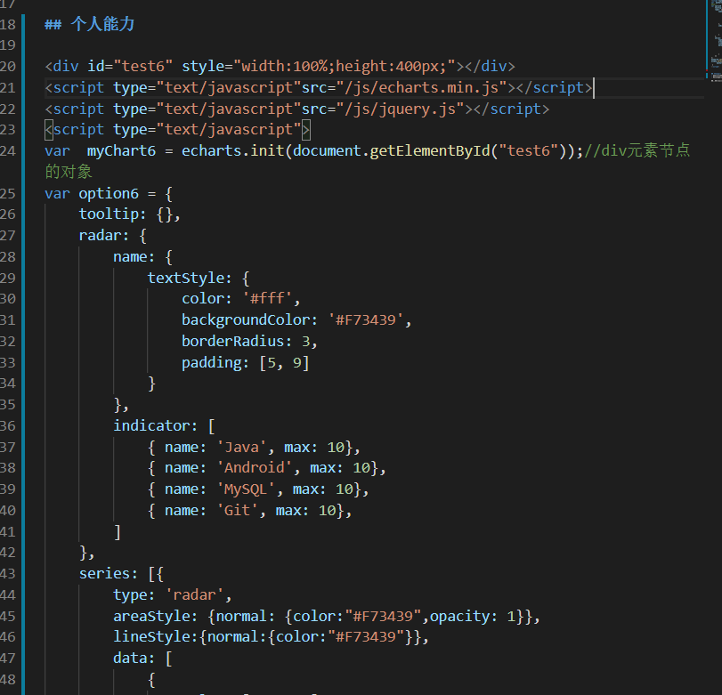
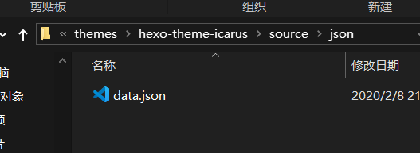

# 缘由
开始的时候看到别人家的博客，[水寒的博客](https://dp2px.com/book/)，而且自己也想在线整理知识点什么的
# 步骤
## 1.下载所需Echarts的js文件
[echarts.min.js传送门](https://github.com/apache/incubator-echarts/tree/4.6.0/dist)

有时候还可能用到json数据等，所以要引入`jquery.js`
[jquery.js传送门](http://blog.jquery.com/)

总之要获得两个js文件
- `echarts.min.js` 主要的js文件，
- `jquery.js` 当要用jquery调用json文件时加入

然后放在`Hexo\themes\<theme~name>\source\js`下

<!--more-->

## 2.直接在文章中写
直接在markdown里贴代码就行！像这样



就可以在文章插入既漂亮逼格又高的图表了！

> 下面给出一些例子，可以根据自己的喜好魔改😋

## 3.例子

## 1.树图
首先要准备`json`数据,这里提供一份简单的json数据:

```json
{
    "children": [
        {
            "children": [
                {
                    "children": [
                        {
                            "children": [],
                            "name": "1.1.1"
                        },
                        {
                            "children":[],
                            "name": "1.1.2"
                        }
                    ],
                    "name": "1.1"
                    
                },
                {
                    "children":[],
                    "name": "1.2"
                }
                
            ],
            "name": "第一章"
        },
        {
            "children": [
                {
                    "children": [],
                    "name": "2.1"
                    
                },
                {
                    "children":[],
                    "name": "2.2"
                }
            ],
            "name": "第二章"
        }
    ],
    "name": "目录"
}
```
然后我是在`Hexo\themes\<theme~name>\source\js`下建了一个`json`文件夹,用于存放json文件,然后把上述的代码放进一个json文件里像这样:



然后在文章.md文件中直接贴上这段代码即可
```markdown
<div id="test" style="width:100%;height:500px;"></div>
<script type="text/javascript"src="/js/echarts.min.js"></script>
<script type="text/javascript"src="/js/jquery.js"></script>
<script type="text/javascript">
var  myChart = echarts.init(document.getElementById("test"));//div元素节点的对象
myChart.showLoading();
$.getJSON('/json/data.json', function (data) {
    myChart.hideLoading();
    echarts.util.each(data.children, function (datum, index) {
        index % 2 === 0 && (datum.collapsed = true);
    });
    myChart.setOption(option = {
        tooltip: {
            trigger: 'item',
            triggerOn: 'mousemove'
        },
        series: [
            {
                type: 'tree',
                data: [data],
                top: '1%',
                left: '7%',
                bottom: '1%',
                right: '20%',
                symbolSize: 7,
                label: {
                    position: 'left',
                    verticalAlign: 'middle',
                    align: 'right',
                    fontSize: 15
                },
                leaves: {
                    label: {
                        position: 'right',
                        verticalAlign: 'middle',
                        align: 'left'
                    }
                },
                expandAndCollapse: true,
                animationDuration: 550,
                animationDurationUpdate: 750
            }
        ]
    });
});

</script>
```
成果如下:

<div id="test" style="width:100%;height:500px;"></div>
<script type="text/javascript"src="/js/echarts.min.js"></script>
<script type="text/javascript"src="/js/jquery.js"></script>

## 2.雷达图
```markdown
<div id="test2" style="width:100%;height:500px;"></div>
<script type="text/javascript"src="/js/echarts.min.js"></script>
<script type="text/javascript"src="/js/jquery.js"></script>
<script type="text/javascript">
var  myChart2 = echarts.init(document.getElementById("test2"));//div元素节点的对象
option2 = {
    title: {
        text: '基础雷达图'
    },
    tooltip: {},
    legend: {
        data: ['预算分配（Allocated Budget）', '实际开销（Actual Spending）']
    },
    radar: {
        // shape: 'circle',
        name: {
            textStyle: {
                color: '#fff',
                backgroundColor: '#999',
                borderRadius: 3,
                padding: [3, 5]
            }
        },
        indicator: [
            { name: '销售（sales）', max: 6500},
            { name: '管理（Administration）', max: 16000},
            { name: '信息技术（Information Techology）', max: 30000},
            { name: '客服（Customer Support）', max: 38000},
            { name: '研发（Development）', max: 52000},
            { name: '市场（Marketing）', max: 25000}
        ]
    },
    series: [{
        name: '预算 vs 开销（Budget vs spending）',
        type: 'radar',
        // areaStyle: {normal: {}},
        data: [
            {
                value: [4300, 10000, 28000, 35000, 50000, 19000],
                name: '预算分配（Allocated Budget）'
            },
            {
                value: [5000, 14000, 28000, 31000, 42000, 21000],
                name: '实际开销（Actual Spending）'
            }
        ]
    }]
};
myChart2.setOption(option2);
window.onresize=function(){
      myChart2.resize();
 } 
</script>
```
如下

<div id="test2" style="width:100%;height:500px;"></div>

## 3.简单柱状图

```markdown
<div id="test3" style="width:100%;height:500px;"></div>
<script type="text/javascript"src="/js/echarts.min.js"></script>
<script type="text/javascript"src="/js/jquery.js"></script>
<script type="text/javascript">
var  myChart3 = echarts.init(document.getElementById("test3"));//div元素节点的对象
option3 = {
    xAxis: {
        type: 'category',
        data: ['Mon', 'Tue', 'Wed', 'Thu', 'Fri', 'Sat', 'Sun']
    },
    yAxis: {
        type: 'value'
    },
    series: [{
        data: [120, 200, 150, 80, 70, 110, 130],
        type: 'bar'
    }]
};
myChart3.setOption(option3);
window.onresize=function(){
      myChart3.resize();
 } 
</script>
```
效果如下:

<div id="test3" style="width:100%;height:500px;"></div>

## 4.简单折线图

```markdown
<div id="test4" style="width:100%;height:500px;"></div>
<script type="text/javascript"src="/js/echarts.min.js"></script>
<script type="text/javascript"src="/js/jquery.js"></script>
<script type="text/javascript">
var  myChart4 = echarts.init(document.getElementById("test4"));//div元素节点的对象
option4  = {
    xAxis: {
        type: 'category',
        data: ['Mon', 'Tue', 'Wed', 'Thu', 'Fri', 'Sat', 'Sun']
    },
    yAxis: {
        type: 'value'
    },
    series: [{
        data: [820, 932, 901, 934, 1290, 1330, 1320],
        type: 'line'
    }]
};

myChart4.setOption(option4);
window.onresize=function(){
      myChart4.resize();
 } 
</script>
```
效果如下：

<div id="test4" style="width:100%;height:500px;"></div>

<script type="text/javascript">
var chartsArr=[];
//test
var  myChart = echarts.init(document.getElementById("test"));//div元素节点的对象
myChart.showLoading();
$.getJSON('/json/data.json', function (data) {
    myChart.hideLoading();
    echarts.util.each(data.children, function (datum, index) {
        index % 2 === 0 && (datum.collapsed = true);
    });
    myChart.setOption(option = {
        tooltip: {
            trigger: 'item',
            triggerOn: 'mousemove'
        },
        series: [
            {
                type: 'tree',
                data: [data],
                top: '1%',
                left: '7%',
                bottom: '1%',
                right: '20%',
                symbolSize: 7,
                label: {
                    position: 'left',
                    verticalAlign: 'middle',
                    align: 'right',
                    fontSize: 15
                },
                leaves: {
                    label: {
                        position: 'right',
                        verticalAlign: 'middle',
                        align: 'left'
                    }
                },
                expandAndCollapse: true,
                animationDuration: 550,
                animationDurationUpdate: 750
            }
        ]
    });
    chartsArr.push(myChart);
});
//test2
var  myChart2 = echarts.init(document.getElementById("test2"));//div元素节点的对象
var option2 = {
    title: {
        text: '基础雷达图'
    },
    tooltip: {},
    legend: {
        data: ['预算分配（Allocated Budget）', '实际开销（Actual Spending）']
    },
    radar: {
        // shape: 'circle',
        name: {
            textStyle: {
                color: '#fff',
                backgroundColor: '#999',
                borderRadius: 3,
                padding: [3, 5]
            }
        },
        indicator: [
            { name: '销售（sales）', max: 6500},
            { name: '管理（Administration）', max: 16000},
            { name: '信息技术（Information Techology）', max: 30000},
            { name: '客服（Customer Support）', max: 38000},
            { name: '研发（Development）', max: 52000},
            { name: '市场（Marketing）', max: 25000}
        ]
    },
    series: [{
        name: '预算 vs 开销（Budget vs spending）',
        type: 'radar',
        // areaStyle: {normal: {}},
        data: [
            {
                value: [4300, 10000, 28000, 35000, 50000, 19000],
                name: '预算分配（Allocated Budget）'
            },
            {
                value: [5000, 14000, 28000, 31000, 42000, 21000],
                name: '实际开销（Actual Spending）'
            }
        ]
    }]
};
myChart2.setOption(option2);
chartsArr.push(myChart2);
var  myChart3 = echarts.init(document.getElementById("test3"));//div元素节点的对象
var option3 = {
    xAxis: {
        type: 'category',
        data: ['Mon', 'Tue', 'Wed', 'Thu', 'Fri', 'Sat', 'Sun']
    },
    yAxis: {
        type: 'value'
    },
    series: [{
        data: [120, 200, 150, 80, 70, 110, 130],
        type: 'bar'
    }]
};
myChart3.setOption(option3);
chartsArr.push(myChart3);
var  myChart4 = echarts.init(document.getElementById("test4"));//div元素节点的对象
var option4  = {
    xAxis: {
        type: 'category',
        data: ['Mon', 'Tue', 'Wed', 'Thu', 'Fri', 'Sat', 'Sun']
    },
    yAxis: {
        type: 'value'
    },
    series: [{
        data: [820, 932, 901, 934, 1290, 1330, 1320],
        type: 'line'
    }]
};
myChart4.setOption(option4);
chartsArr.push(myChart4);
window.onresize=function(){
      for(var i=0;i<chartsArr.length;i++){
          chartsArr[i].resize();
          }
    }
</script>

更多样式请访问官网 [Echart官方实例](https://echarts.apache.org/examples/zh/index.html)

# 参考资料
- 🚩Echarts图的大小自动调整问题请戳👉 [Echarts跟随容器自适应大小问题](https://www.cnblogs.com/harlem/p/7779609.html)
- [echarts中的树形结构图（参数分析）](https://blog.csdn.net/qq_40594137/article/details/80263015)
- [在 Hexo 中插入 ECharts 动态图表 ](https://kchen.cc/2016/11/05/echarts-in-hexo/#fnref:1)
- [Echarts官网](https://echarts.apache.org/zh/index.html)s
- [Hexo 如何引入自定义 js 文件 ](https://wxnacy.com/2017/12/12/hexo-cust-js/)
- [Hugo 中使用思维导图](https://wocai.de/post/2019/03/hugo-%E4%B8%AD%E4%BD%BF%E7%94%A8%E6%80%9D%E7%BB%B4%E5%AF%BC%E5%9B%BE/)
- [在 Hexo 中使用思维导图](https://hunterx.xyz/use-mindmap-in-hexo.html)
- [Hexo中使用markdown来绘制脑图（mind map）](https://qsli.github.io/2017/01/01/markdown-mindmap/)

# 未解决问题
## 关于markdown转`json`工作未做好

未来是想是做一个可以把类似
```
# 序
## 1
### 1.1
### 1.2
## 2
### 2.1
```
这的markdown语句转化成树图可以直接用的`json`数据

## 树图默认全部展开

暂时还没做到。。

# 文章更改日志
## 2020年2月8日

修改了部分echarts不能自动调整的问题，Echarts图的大小自动调整问题请戳👉 [Echarts跟随容器自适应大小问题](https://www.cnblogs.com/harlem/p/7779609.html)

## 2020年2月9日

发现了网页慢是因为引入了`echarts.js`，一看才知道2m多，👴惊了，已经删除，文章大体没什么问题了


> 忙活了两天的成果，有些问题还傻傻的跑到StackOverflow去问呢，原来是一些很基础的问题，细节很重要啊，还有要多思考🏓，这个问题本来就很简单，但是我基础不牢，然后又心浮气躁，本早该解决的问题竟然拖了两天，今后我应更注重追求本质的东西，静下心来好好思考
