# 参考教程

- 学习教程：[廖雪峰的Git教程](https://www.liaoxuefeng.com/wiki/896043488029600)
- 测试：[learngitbranching](https://learngitbranching.js.org/)

# 脑图(更新中)

# 笔记

## 🥝简介

由Linus用c语言开发的分布式版本控制系统

## 💉版本穿梭

可先用`git log`指令查看一下有几个版本提交到了仓库里
<!--more-->
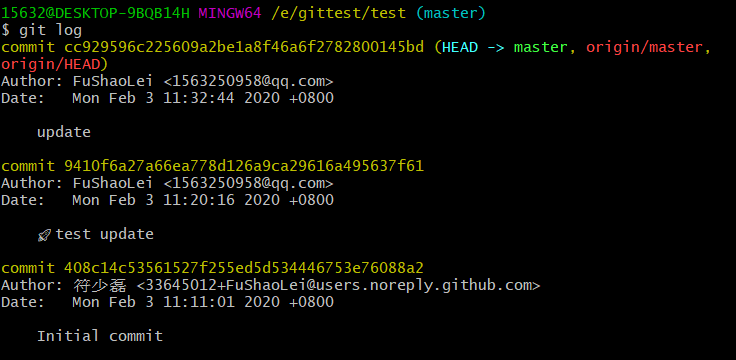

或用`git log --pretty=oneline`可以简单的看到版本号

### 版本倒退（回过去）

`git reset --hard ?`  
**?里**
- 可以填`HEAD^`标识上个版本，上上个版本就是`HEAD^^`，假如更上的话就是`HEAD~100`
- 也可以直接填版本号，只要写前几个就行，比如上面直接写`git reset --hard 9410f`就会退回到上一个版本了

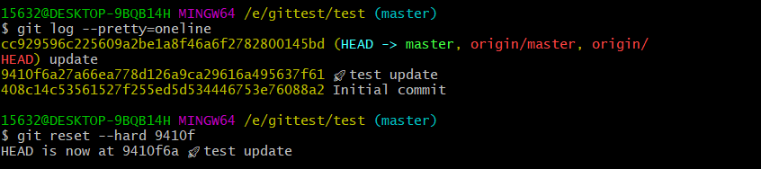

### 版本恢复（去未来）

首先查看一下历史信息`git reflog`,然后根据版本号写`git reset --hard 版本号`,就这么简单😋

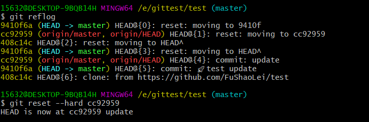

## 🛀工作区和暂存区
`git add 文件`指令是把文件修改添加到暂存区
而`git commit -m "XXXX"`就是往分支上提交更改

### 撤销修改

#### 撤销未被`git add`的修改

`git checkout -- file`可以把`file`在工作区的修改全部撤销
这里出现了两种情况
- 未`git add`，那么将恢复到未被修改的样子
- 已`git add`，然后又修改了一下，那么将恢复到`git add`后的样子，就是恢复到最近一次`git add`后的样子

#### 撤销提交到`git add`的修改
这里分两步走：
- 首先要把在暂存区的给提出来，`git restore --staged file`，也就是恢复到未提交修改的状态
- 然后在`git checkout -- file` 把在工作区的修改（`git restore --staged file`提出来的）全部撤销

**注：**
由于git更新换代，所以这里与廖老师的有些出入，关于`git restore --staged file`的功能如下：

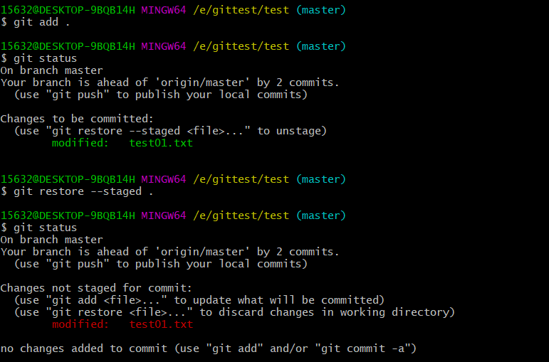

### 删除文件

#### 删错了
可以用`git checkout -- file（被删文件名）`来恢复那个被删文件

#### 确实要删
直接`git rm file（要删文件名）`，然后再`git commit `提交修改，就行了

> 一些想法：这里的`git rm file`实际上也是将要做的修改提交到暂存区，然后`git commit`才提交修改，因此如果这里想反悔的话，可以用`git restore --staged file`把在暂存区的修改给撤销掉
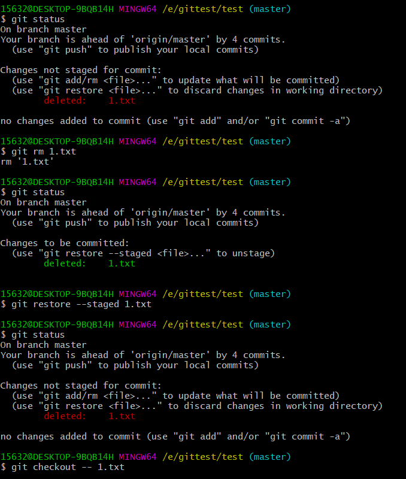
由图很简单的知道，绿色就代表放入了暂存区，红色就代表未放入

由上面许许多多案列可以知道，git操作时，总是先在暂存区里进行操作，然后再提交到分支上🔑

## 🤳分支管理
### 创建 合并分支
#### 创建
`git switch -c <branch~name>`可以创建然后并转换到这个分支上
`git switch <branch~name>`可用于切换分支，`git branch`可以看到已有分支，前面带一个`*`的表示现在所在的分支
`git branch -d <branch~name>`这个指令用于删除分支，前提是切换到了其他分支，
如下
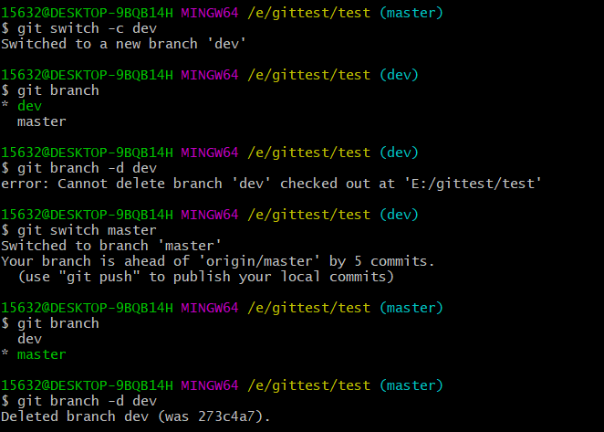
#### 关于合并
`git merge <branch~name>`合并分支，**产生的冲突只发生在当前的分支上**
##### 🔥合并冲突与解决方法
> 产生原因：分支与分支在同一个地方（有待研究）的**不同修改**导致合并时的冲突,这时只能手动的修改冲突的地方，并提交

产生冲突后：

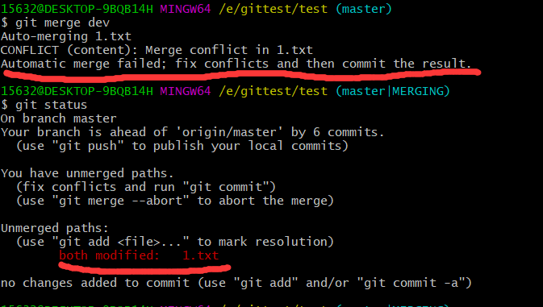
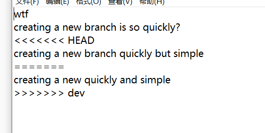

这时只能手动修改后提交（`git add`， `git commit`）

提交完后可通过 `git log --graph --pretty=oneline --abbrev-commit`查看合并的情况
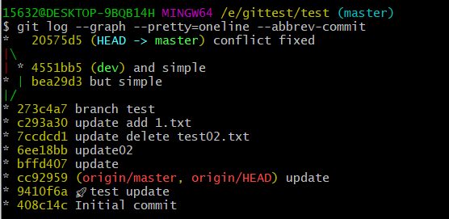

简单总结一下，合并产生的冲突**只能手动解决后提交**

> 终于明白上学期和别人合写App时会出现的`<<<<<<HEAD`标识了😋

###### 💧合并分支时的模式
- 普通的`git merge <branch~name>` 优先采用`Fast forward`模式，不会记录分支信息
- 用`git merge --no-ff -m "xxxx" <branch~name>`会禁用`Fast forward`模式 则会记录分支

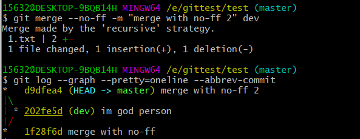

### BUG分支
修复bug时，通过创建新的分支来进行修复，然后合并到`master`

当工作现场没有完成的时候👉`git stash`隐藏工作现场以方便修改bug，用`git stash list`可查看隐藏的东西，当修复完后可用`git stash pop`来进行恢复

> **注：** `git stash pop`（恢复工作现场并删除隐藏）=`git stash apply`（恢复工作现场）+`git stash drop`（删除隐藏）
>> 有的时候需要一个个恢复工作现场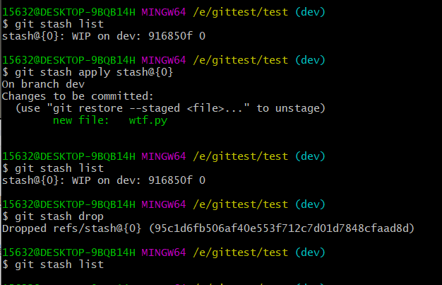
那就应该先`git stash list`查看一下隐藏的列表，再`git stash apply stash@{x}`恢复，然后还有`git stash drop`

#### 在master修复的bug的操作复制到其他分支上
 在要复制到的分支（此分支得先`commit`后再操作）上：`git cherry-pick  <commit码>`这里的 `<commit~码>`是指修复bug的分支的commit号，就像下面这张图的`34bbddd`

 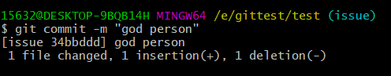
 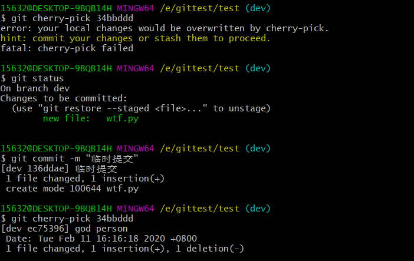

### 📌多人协作(待重读，未总结)

`git remote -v`可以查看远程库的信息，可以发现，若本地的分支如不推送到远程，对其他人是不可见的，可用`git push origin <branch~name>`来推送，如果失败可以先`git pull`然后再修改什么的，在本地创建和远程分支对应的分支，使用`git checkout -b branch-name origin/branch-name`，本地和远程分支的名称最好一致；
建立本地分支和远程分支的关联，使用`git branch --set-upstream branch-name origin/branch-name`
从远程抓取分支，使用`git pull`，如果有冲突，要先处理冲突。

### 📌rebase(未理解)
`git rebase`操作可以把本地未push的分叉提交历史整理成直线；

## 🍻指令总结

指令 | 说明 
:-: | :-: |
`git init` | 初始化 
`git status` | 查看状态 
`git diff .` | 可以查看具体被修改了那些内容（应在`git add .`前使用）
`git log` | 可以查看有几个版本提交到仓库里
`git log --pretty=oneline` | 同上，不过简化了些
`git reflog` | 可以查看每一次命令（可以看到版本号）
`gir reset --hard 版本号` | 版本退回或回溯
`git add 文件名` | 把修改放到暂存区
`git commit -m "xxxxx"` | 一次性把暂存区的所有修改提交到分支上
`git checkout -- <file~name>` | 可把未`git add`的文件修改全部撤销
`git retore --staged <file~name>` | 把`<file~name>`在暂存区的东西移出(到工作区，也就是可以进行`git checkout -- <file~name>`操作)
`git rm <file~name>` | 删除file文件，并提交修改到暂存区中
`git switch <branch~name>` | 切换分支
`git switch -c <branch~name>` | 创建并切换到新的分支
`git branch` | 查看已有分支，带`*`的是现所在分支
`git branch -d <branch~name>` | 删除分支（前提是已`switch`到其他分支上）
`git branch -D <branch~name>` | 删除分支,强行删除
`git merge <branch~name>` | 合并分支（优先采用`Fast forward`模式）
`git merge --no-ff -m "xxxx" <branch~name>` | 合并分支（禁用`Fast forward`模式）
`git log --graph --pretty=oneline --abbrev-commit` | 查看合并情况
`git stash` | 隐藏工作现场
`git stash list` | 可查看`stash`的东西
`git stash pop` | 恢复工作现场，注：`git stash pop`=`git stash apply`+`git stash drop`
`git cherry-pick  <commit码>` | 复制操作
`git remote` | 查看远程库的信息，用`git remote -v`可以看到更详细的信息
`git push origin <branch~name>` | 推送名为`<branch~name>`的分支 

