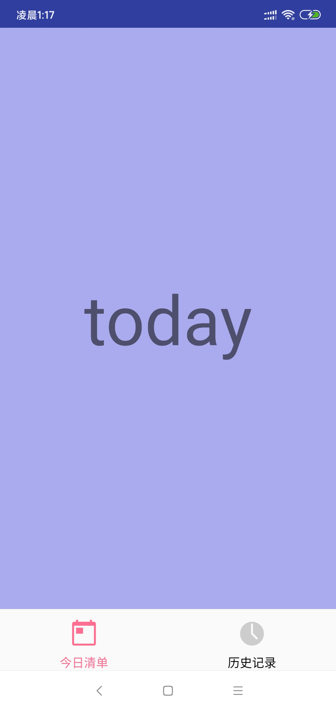
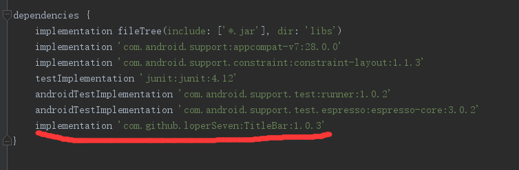
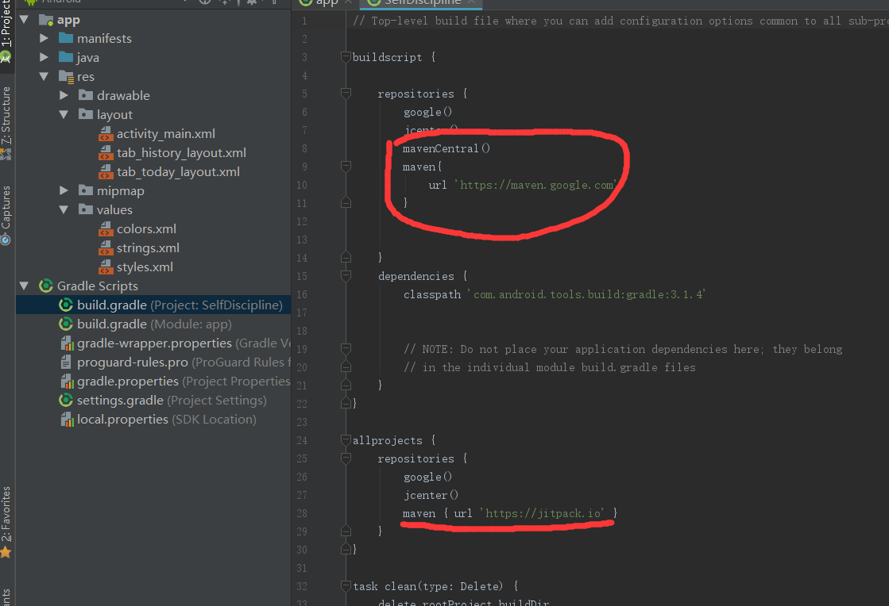
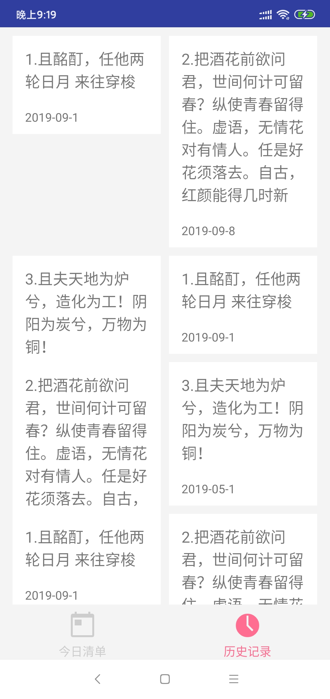

# 初衷

自用软件，帮助自己更好的掌控生活以及时间，打算做的简单一些，打算边做边总结一些技巧，给自己一些信心嘛😋

[github仓库地址](https://github.com/FuShaoLei/SelfDiscipline)

<!--more-->

# 开发日志
## 2020年1月14日
- 写了一些想法
- 简单完成了底部导航栏，确定了色调 `#ff6d91` 和主要图标



### 遇到的一些sb问题

就是引入titlebar的时候老是编译错误



最后才知道要改这里，就好了
 真的贼傻逼这个问题



## 2020年1月15日

今天完成了**今日清单**和**历史记录**的大概ui设计，并添加了悬浮按钮


### 遇到的问题

我原本想把**历史记录**这个gridview搞成瀑布流的样子的，就是根据内容大小而紧凑排序
但是却变成了这样🙃


上网搜了搜，发现一个叫stagglegridview（似乎是这个名🐷）可以实现这个功能，不过进github一看，居然是好几年前的库，就没敢用，改天有空我要自己写一个（先立个flag😋）

于是我改成了同样的内容，超出部分省略的的样子，就是开头看到的那样

### 小技术点总结

##### 浮动button的使用
```java
//添加依赖
//floatingactionbutton
    implementation 'com.getbase:floatingactionbutton:1.10.1'
//在xml中 就直接用就行，然后再java里也像普通的button一样用就行
<com.getbase.floatingactionbutton.AddFloatingActionButton
        android:layout_width="wrap_content"
        android:layout_height="wrap_content"
        />
```
##### GridView
```java
//消除滚动条，在xml里添加
android:scrollbars="none"
//设置间隙,在xml里添加
android:horizontalSpacing="10dp"//设置水平间隙
android:verticalSpacing="10dp"//设置垂直的间隙
```
##### TextView超出文字用..代替
```java
//在xml里添加
android:ellipsize="end"//不知道用来干嘛的QAQ
android:maxEms="200"//限制字数
android:maxLines="3"//限制行数
```