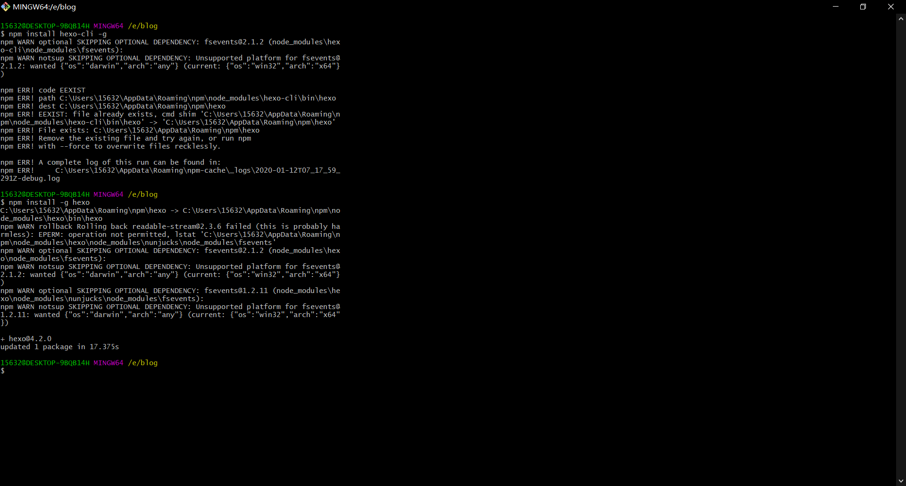
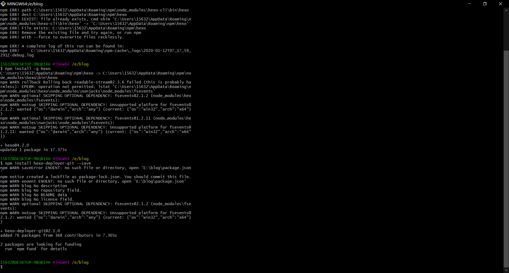
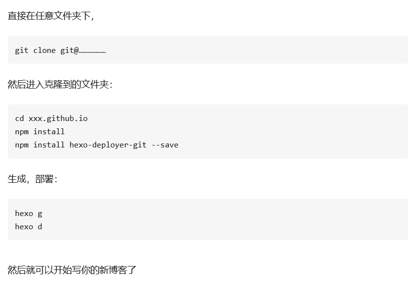
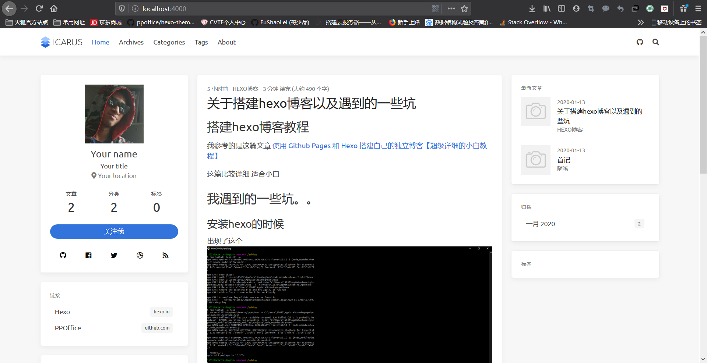
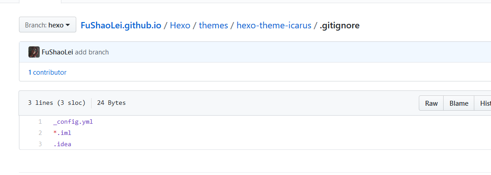
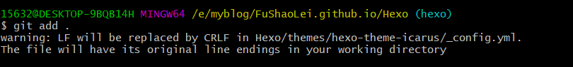

# 搭建hexo博客教程

我参考的是这篇文章 [使用 Github Pages 和 Hexo 搭建自己的独立博客【超级详细的小白教程】](https://blog.csdn.net/qq_36759224/article/details/82121420)

这篇比较详细 适合小白

# 我遇到的一些坑。。
## 安装hexo的时候
出现了这个


用官方的指令老是报错
翻了墙也不行TAT
最后用了下面的指令终于可以了

```c
npm install -g hexo
```
<!--more-->



还有下面这个
```c
npm install hexo-deployer-git --save
```

我也是弄了两边才行，不知道为什么(￣_￣|||)
这应该就是学习只知学表面的后果吧

## 关于备份以及迁移

我搭这个新博客就是因为上次那个重装电脑后忘记备份了QAQ，还好没有写什么东西，惨痛的教训

关于备份以及迁移我是看这篇文章的
[使用hexo，如果换了电脑怎么更新博客？ - 直上云霄的回答 - 知乎](https://www.zhihu.com/question/21193762/answer/489124966)

我这里也稍微做一下笔记，以防后患

### 备份完后的博客更新
#### 部署上传
```git
hexo d -g
```
#### 源文件上传(核心)

```git
git add .
git commit -m "xxxxx"
git push
```

### 更换电脑或者重装电脑后的操作

一开始无非就是安装好git啊，什么node.js
啊 还有设置ssh key啊，这些基本的东西在开头的那篇小白连接都有讲到
要注意的是安装完hexo，不需要再hexo init了
懒了，直接引用原文章的话



## 主题的设置在重新clone后就没有了




上图是clone后本地测试时，下图是原来的，是不是不一样＞﹏＜

原因在下面这张图里，即 在.gitignore文件里包含了主题的配置文件，意思就是主题的配置文件不会上传到git上，以及*.iml和.idea不过我不知道是用来干嘛的QAQ



试着解决这个问题，把.gitignore里的主题配置文件删了，也就是可以上传到github上了

然后再git add .就出现了问题



原因参考这篇文章 [Git warning：LF will be replaced by CRLF in readme.txt的原因与解决方案](https://blog.csdn.net/Starry_Night9280/article/details/53207928)


好像说的是不同系统的换行符不一样什么什么的
只要输入一下指令就可以了
```java
git config --global core.autocrlf false
```
继而是上传到github，然后把本地文件删掉，再clone一次
再什么npm install什么的
最后大功告成！


# 其他
```java
//标签
tags: hexo
//分类
categories: hexo博客
//多级分类
categories: 
- 父级
- 子级
//阅读更多——只需要在摘要部分的底部加上
<!--more-->

```
## 创建自定义页面
```
hexo new page "board"
```
然后再_config.yml里添加新页面的标识
```
留言板: /board
```