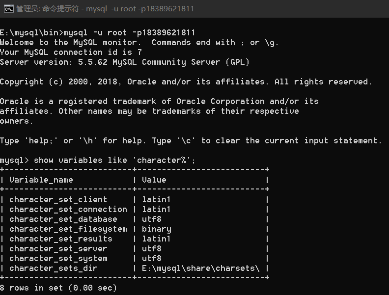
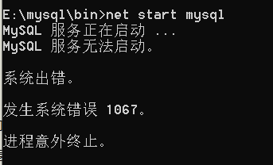

# 查看mysql的编码方式
```
show variables like 'character%';
```
然后就出现了
<!--more-->


继而


但是重启数据库后发现，还是原来的样子，并没有根本解决问题😭😭

网上搜了一圈后 找到了个比较详细的文章 
[mysql5.5 解决中文乱码问题 修改默认编码为utf8](https://blog.csdn.net/ghyg525/article/details/71637032)

然后我在执行`net stop mysql`和`net start mysql`的时候又参考了这篇文章
[cmd中输入net start mysql 提示：服务名无效或者MySQL正在启动 MySQL无法启动](https://www.cnblogs.com/ivy-zheng/p/11088644.html)

然后贼傻逼的出现了



我的马鸭😭😭😭😭😭

## 2020年1月16日

重启电脑后mysql就可以正常用了，但编码方式还是没变😭


