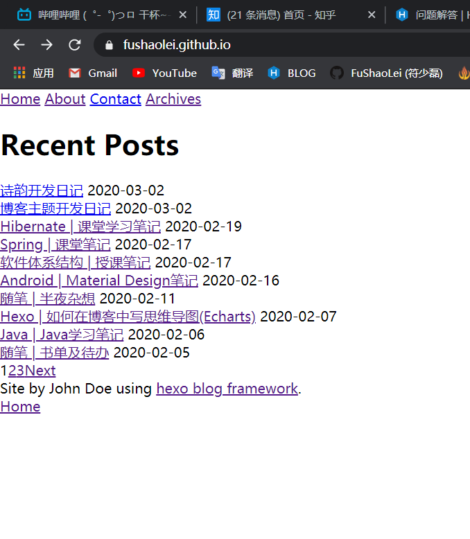
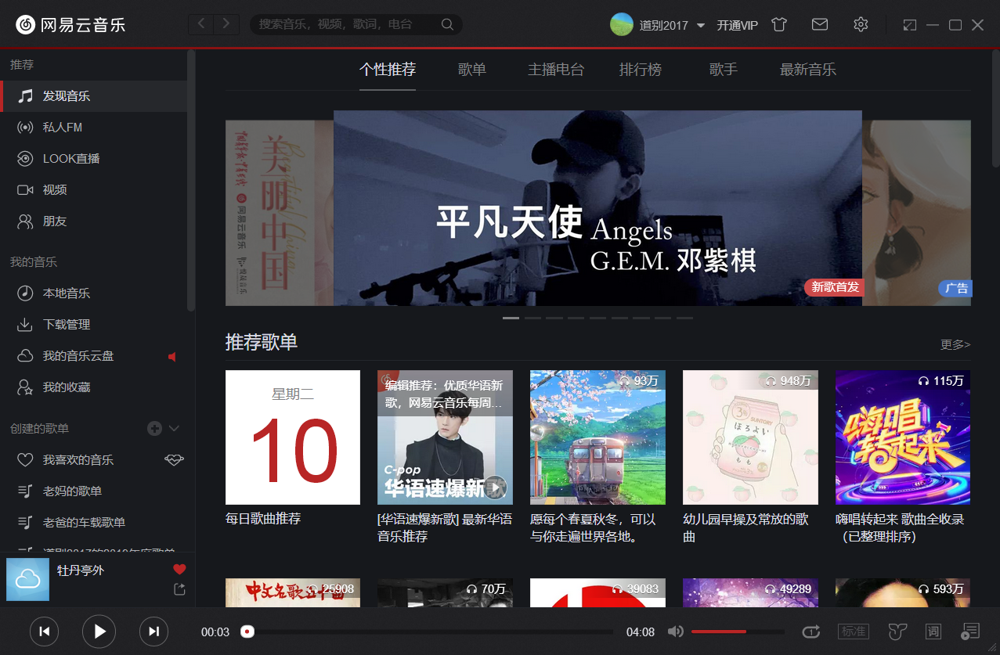
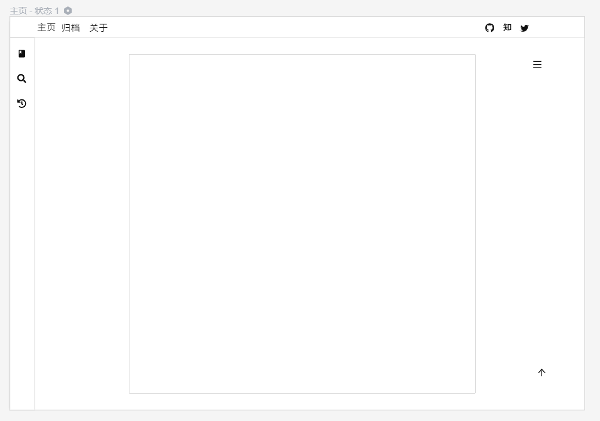
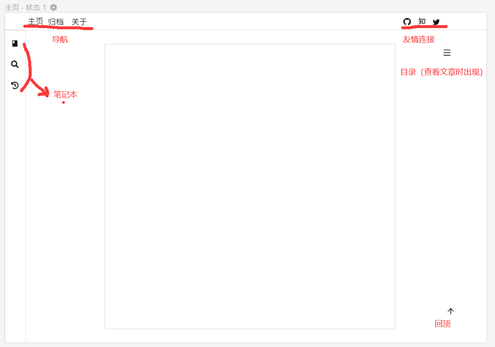

# 记于2020年2月25日凌晨
今天想用`gitbook`来弄自己的笔记本，结果在`gitbook build`这里卡住了，又是google又是问朋友的，弄的身心俱疲，然后再hexo官网也找到了一些类似的主题，有一个都不知道怎么用，有一个太丑了，（没错 我就是这么挑剔），现在自己准备着手弄一个主题，这算是开题笔记吧！

我想的是这个博客主题即可以记录一些琐碎的知识（或者日常什么的），又可以有像gitbook一样的功能，当然这两者是分开的，在不同板块，这样的话即可以看到自己的一些日常记录，又可以随时查阅自己的文档笔记，简直方便的不要不要的。另外主题名aurora意思是曙光的意思（在知乎上搜的），这算开坑了，接下来要努力填坑😋

# 开发规划
## 技术栈：ejs（模板引擎），stylus（CSS预处理）
## 设计
> 参考了下好多主题，以及结合自己的一些感受，到现在我都不知道tag页面是拿来干什么的

页面：
- 🚩`博客`：用来记录日常的比较琐碎的一些知识点
- 🚩`归档`:生成时间线，有类似github那种提交记录
- 🚩`详情页`：详细展示文章
- 🚩`笔记本`：用于整理，类似onenote那种，gitbook那种(根据categaries生成)

笔记本页面原型基本确定是类似于onenote一样的风格，另外博客页面我想要个性化一点的
现在为止我觉得比较骚比较特殊的网址：
- https://html5up.net/ethereal
- https://canisminor.cc/blog/posts/20180820_canisminor

# 开发日记

## 2020年3月2日
返 璞 归 真

## 2020年3月10日上午
今天真是取的突破性的一天，虽然css美化方面的工作还没做好，不过我理想的“博客+文档”形式的主题的主要功能已经差不多完成了！😘
还需要解决的
- 修复pjax偶尔刷新不出来的bug
- 把文档目录搞成抽屉的形式
- 美化主题
- floating action button
- 解决文档目录有时候会重新刷新的bug

## 2020年3月10日下午

主题色也有待考虑，不过现在觉得网易云这个暗红配色不错，当时一看也有被惊艳到

主要颜色有：
- 背景：`#16181C`
- 底栏：`#222225`
- 未选中：`#ADAF91`
- 选中后：`#232529`
- 暗红：`#B22323`
- 文字：`#D0D1D2`
- 超链接：`#29568B`

> 已弃案

### 关于封面图的思考
其实这个大可不必，博客有时候是蛮私人的一个东西的，记录自己的心情啊，最近遇到的事情啊，或者计划等等之类的，上次用的哪个博客主题我每次都要去找封面图，现在觉得挺傻的，而且封面图也和内容毫不相干，反正也没人看（有的话也无非就是想看某个技术文章之类的，但不排除其他可能性），而且我做这个主题的主要目的是用上类似`gitbook`那样的文档的功能（我想用来整理课堂笔记什么的），但是有觉得gitbook要编写哪个menu文件太傻逼了，一点也补智能，所以动手做了这个主题，那么我对封面图是没什么需求的，这点可以省略

## 2020年3月16日
再一次心态奔溃，这个css框架是很方便 但会出现一些莫名奇妙的东西，而你又不知道原因在哪，这就是用css框架时不好的地方，你不能任意的定制，还有这个暗黑主题计划要抛弃了，给了我很不好的体验，哎呀 我做事怎么老是这样。
现在决定重新布局，目前在设计原型图。我的目标是做一个非常实用的hexo博客，秒开，然后技术向的，可变文档的，博客主题。不过最近有点忙 又要准备面试，又要补作业什么的。难啊

## 初始的原型图

说明

灵感来自于onenote和gitbook 下一步看看要不要改

## 2020年4月11日凌晨
又进入了瓶颈期，不过大体的方向已经是完整的了，只是遇到了些奇怪的问题：`有些文章页没有渲染全`, 是有内容丢失的

# 感谢&参考资料
- [Hexo主题开发经验杂谈](https://molunerfinn.com/make-a-hexo-theme/#%E5%89%8D%E8%A8%80)
- [hexo博客主题「paper」的设计与开发](https://randomyang.top/2019/12/01/hexo%E5%8D%9A%E5%AE%A2%E4%B8%BB%E9%A2%98%E3%80%8Cpaper%E3%80%8D%E7%9A%84%E8%AE%BE%E8%AE%A1%E4%B8%8E%E5%BC%80%E5%8F%91/)