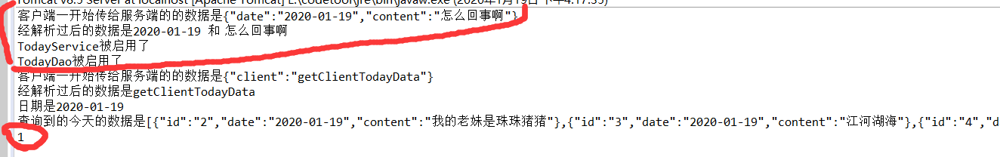

# 开发日记
> 防止第一篇太长，另起一篇来写开发日记😄
## 2020年1月16日

> 今早起来大扫除，几乎没怎么做项目，中午还帮了一个陌生人搞了个hexo博客，觉得蛮开心呢🤣

今天

- 粗略写了一下客户端
- 完善了那个写今日计划的界面,实现了返回什么的功能
- 建了数据库

<!--more-->


### 小技术点总结

#### 获取当前时间（并格式化）
```java
SimpleDateFormat simpleDateFormat=new SimpleDateFormat("yyyy-MM-dd");//格式化样式
Date dates=new Date(System.currentTimeMillis());//获取当前时间
date.setText(simpleDateFormat.format(dates));//在handler里设置
//比如现在，simpleDateFormat.format(dates)得到的就是2020-01-16
```
#### 返回上一页面
```java
finish();//实际上是说结束这个界面，然后就自动会返回上一页面了
```


> ps:感觉我今天全程划水🙄😄

## 2020年1月17日凌晨

今天做好了客户端与服务端的交互：
- 在客户端写东西后传入服务端并写入数据库
- 在服务端获取数据后传入客户端（gridview）

### 问题
那个数据库的编码格式还是没弄好啊啊啊啊啊💔

### 小技术点总结

#### 清空数据库中某张表的全部数据
```java
truncate table_name;
```


> 感觉就应该边做边写，我太相信自己的记忆力了。明明当时想到的要写什么的 现在就忘的的一干二净了😤 现在只感觉今天什么都没做 踏🐴的

## 2020年1月17日下午

### 问题
今天遇到了很有意思的问题，不过现在不是很想学习，先记录一下

> 就是我的`WriteActivity`页面给服务端传完数据后马上就`finish()`也就是结束这一个页面，如何自动返回到了上一个页面`TodayActivity` 这时候我想在`finish()`后给`TodayActivity`的这个页面进行一个刷新,这时候就要用到Activity的生命周期了，现在是搞出来了 但不知道原理😝


先记录一下😋晚上去学，现在想玩玩游戏

## 2020年1月18日

Activity的生命周期👻官方参考文档：[了解 Activity 生命周期](https://developer.android.google.cn/guide/components/activities/activity-lifecycle.html)


这样一来就真相大白了：
> 原先点入`WriteActivity`后调用了`onPause()`方法，写完后退出来（`finish()`）然后就返回原先的`TodayActivity`，进入了`onPause()`右边箭头的方向，既 返回调用了`onResume()`方法，这就是为什么要返回`TodayActivity`时再做操作的修改`onResume()`的原因了🐥

## 2020年1月18日晚上

### mysql又出问题了😭

刚开始只是想测试一下昨天的成果的，没想到。。


然后想进入mysql一开，结果！！！！


卧槽！！！！！！这是什么人间疾苦啊！！！！
是时候重按装一遍mysql了 这傻逼玩意 给👴死

## 2020年1月19日下午

### 终于 mysql重装好了😹

参考文章：

- [干净卸载mysql，个人亲测，这一次终于成功了](https://blog.csdn.net/cxy_Summer/article/details/70142322)

- [MySQL 8.0.18安装教程(windows 64位)](https://blog.csdn.net/qq_37350706/article/details/81707862)

#### 需要注意的地方

这里不一样了 要修改成这样：


最后还是报了个傻逼错误


不过暂时不影响使用，就没太管

### 遇到了个糟心的错误QAQ

就是前面所讲的2020年1月17日下午那个问题，现在不知道为什么
是这样的



红线部分以及圈起来的部分是`填入数据库的`也就是说，`finish()`返回到`TodayActivity`的时候，数据还没添加好。这时候就再拉取一次数据，然后就没有拉取到最新的，啊啊啊，明明那天还是好好的啊，怎么回事😭

## 2020年1月19日晚上

> 现在是2020年1月19日20点08分 ，github从昨天开始我就访问不了了，不知道是我的原因还是github的原因😱

暂且给`TodayActivity`加上智能刷新的功能，还做了`FloatingActionButton`的优化，现在是想搞成两种代办模式

- 一 是简单的代办，今日待办什么的
- 二 是需要长时间做的待办（想搞成每天自动分配的待办，但需要开始时一下子写好，只是一些尚未成熟的想法。。😪）

### 小知识点总结

#### Toast的简单使用
```java
Toast.makeText(getActivity(),"要说的话",Toast.LENGTH_LONG).show();
```
## 2020年1月20日凌晨

现在做好了简单的点击item后跳转，感觉今天也全程在划水o(*￣▽￣*)o

## 2020年1月20日下午

现在找到了一个进入github的方法，不知道管不管用
[github上不去解决方法](https://www.jianshu.com/p/93f0489606a5)

