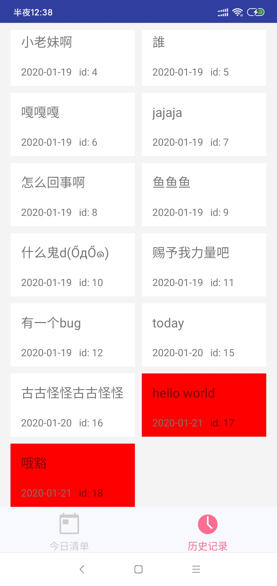

# 开发日记
## 2020年1月21日凌晨
> 今早玩了一早上游戏，下午学了会`python`，晚上也都在玩守望排位，还没有上分，明明那么努力了，暴雪能不能给我点正常队友啊🤧
今天不怎么想做，懒咯
不过现在完成了一个比较有意思的功能，就是可以特殊定制item的背景颜色，
<!--more-->
如下
（如果是今日是计划就设背景为红色）


**做法**
刚开始是想在gridview里改的 发现行不了，最后想到在`Adapter`里面改，而且item的布局也有些讲究，第一次的`LinerLayout`设为白色的，普通的就是白色的，然后再套一层`LinerLayout`是用来特殊定制，这样只要改变这个第二层的背景就行了，
在`Adaper`里这样改就行
```java
/**
* 设置date文字，然后根据情况设置背景颜色
 */
public ViewHolder setTextByDate(int id, int layoutid,CharSequence text) {
//获得今日日期
SimpleDateFormat simpleDateFormat=new SimpleDateFormat("yyyy-MM-dd");
Date dates=new Date(System.currentTimeMillis());
String dateData;//要传入服务端的日期的数据
dateData=simpleDateFormat.format(dates);
            
View view = getView(id);
View view1=getView(layoutid);

if (view instanceof TextView) {
((TextView) view).setText(text);
if(text.equals(dateData)){//如果日期是今日的话，设置不一样的背景颜色
//核心代码
view1.setBackgroundColor(Color.RED);//暂且设为红色
}
}
return this;
}
```

## 2020年1月22日晚上

> 最近也没做什么大的东西，感觉没有激情了🙃，不过今天做了个花里胡哨的东西，就是获取到bing的每日精选壁纸，然后设为背景

### 做法
#### 1.通过okhttp获取到bing提供的json字符串
访问下面这条路径就可以得到相应的字符串
```java
// https://cn.bing.com/HPImageArchive.aspx?format=js&idx=0&n=1&mkt=zh-CN
//n表示数量
//idx=0表示是今天的精选图，-1表示明天的备用（我访问不到QAQ），然后比0大的数字就是以前的
```
获得的字符串类似于：


### 2.解析json字符串，留下url
也就是留下这个


### 3.和前缀`https://cn.bing.com`结合，即为今日的镜选图地址

比如上面，组合起来就是`https://cn.bing.com/th?id=OHR.WhitehorseLights_ZH-CN1415339570_1920x1080.jpg&rf=LaDigue_1920x1080.jpg&pid=hp`即一个图片地址，可以成功访问到了！

### 注意
用Glide以url获取图片后修改LinearLayout的方法：

```java
GlideApp.with(HistoryFragment.this)
        .load(Constant.PREVIOUS_URL + realjson)
        .into(new CustomTarget<Drawable>() {
         @Override
        public void onResourceReady(@NonNull Drawable resource, @Nullable Transition<? super Drawable> transition) {
                linearLayout.setBackground(resource);
        }

        @Override
        public void onLoadCleared(@Nullable Drawable placeholder) {

        }
    });
```
此处还需把那个配置`minSdkVersion 16`要把这个原来的15改为16

这里看了会官方文档才知道用这个方法，好多网上的东西都过时了


[Glide官方文档(翻译)](https://muyangmin.github.io/glide-docs-cn/)

[Glide官方文档（全英）](http://bumptech.github.io/glide/)

> 感觉自己最近变成憨憨了干啥啥不行😖

## 2020年1月24日凌晨

今天给app搞了个图片换了个名字


还有第一页的一些图标


> 都是在这个网站上搞的，蛮好这个网站，💗了💗了
[Android Asset Studio](https://romannurik.github.io/AndroidAssetStudio/index.html)

修改的方法也很简单：
- 改图标：
- 改名字：

